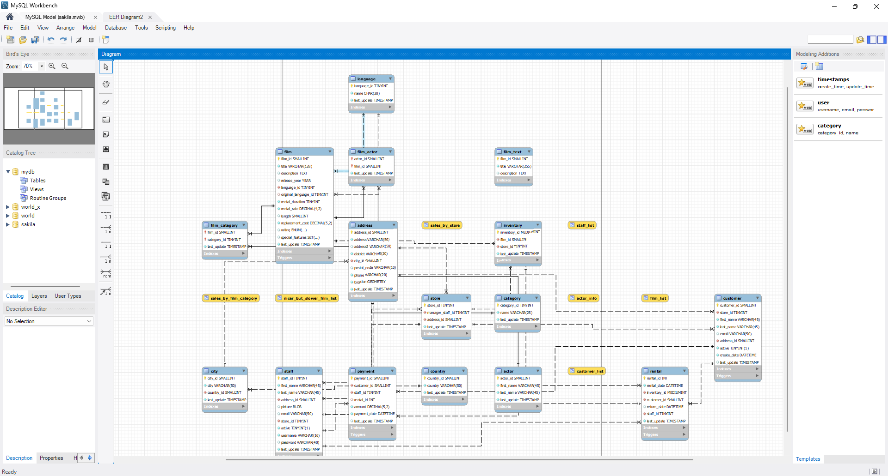

# README

Agenda:

1.  Import sakilla sample database to your local server.([https://dev.mysql.com/doc/sakila/en/sakila-installation.html](https://dev.mysql.com/doc/sakila/en/sakila-installation.html))
2. Write python program that fetches new rentals in last 1 hour in following format, creates a csv and sends email with the csv attachment
    
    (New rentals are registered in rental table, insert new entries or change the rental date on existing rows if necessary)
    
    rental_id | rental_date | Customer Name | film_title | customer's country
    
3. schedule the task to run each hour (you can use any scheduler).

Sakila consists of three files: `sakila-schema.sql`, `sakila-data.sql`, and `sakila.mwb`

`sakila.mwb` consists of data model which looks like:



```sql
/* 
To fetchenew rentals from last 1 hour in the following format:
rental_id | rental_date | Customer Name | film_title | customer's country
*/
SELECT
    r.rental_id,
    r.rental_date,
    CONCAT(c.first_name, ' ', c.last_name) AS customer_name,
    f.title AS film_title,
    co.country AS customer_country
FROM rental r
JOIN customer c ON r.customer_id = c.customer_id
JOIN inventory i ON r.inventory_id = i.inventory_id
JOIN film f ON i.film_id = f.film_id
JOIN address a ON c.address_id = a.address_id
JOIN city ci ON a.city_id = ci.city_id
JOIN country co ON ci.country_id = co.country_id
WHERE r.rental_date >= NOW() - INTERVAL 1 HOUR
```

## Steps to run (without scheduler):

```bash
pip install -r requirements.txt
python main.py
```

## Using Cron job:

```bash
crontab -e
```

```bash
# Add the following script to run the main.py everyhour
0 * * * * /home/abhi/Sakila\ Project/venv/bin/python3 /home/abhi/Sakila\ Project/main.py >> /home/abhi/Sakila\ Project/script.log 2>&1
```

```bash
crontab -l # To verify
```